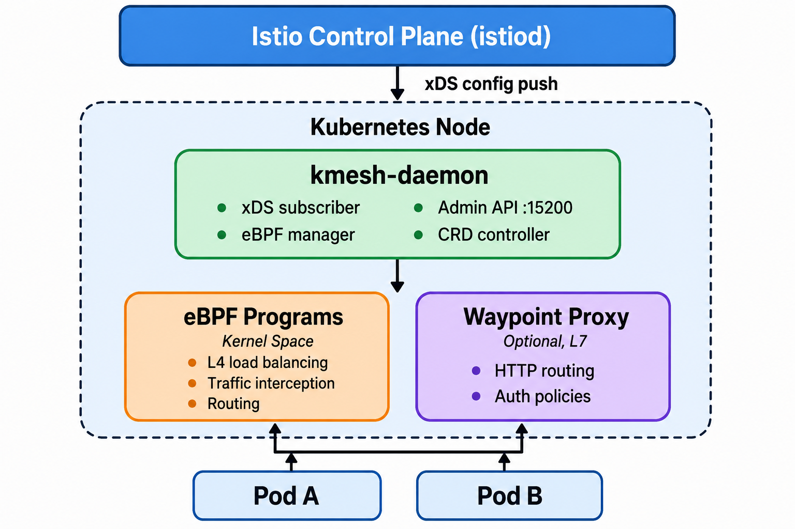
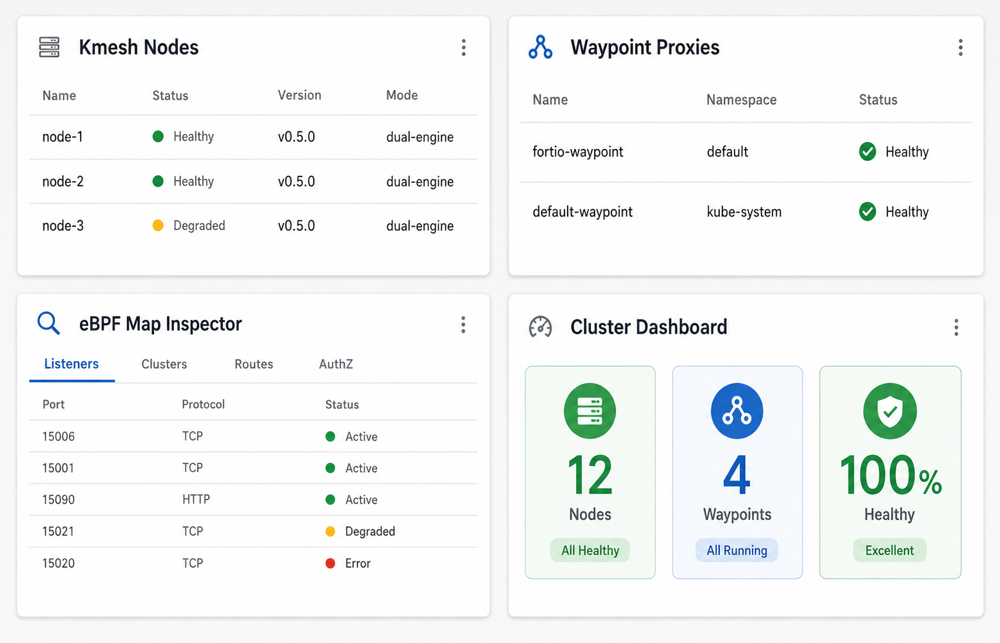
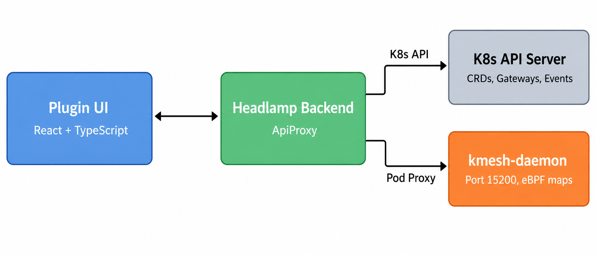

## Introduction

This blog post documents the technical exploration of building a [Headlamp](https://headlamp.dev/) plugin for Kmesh — a project proposed under the CNCF LFX Mentorship program. It covers the architectural decisions, the Headlamp plugin APIs involved, what Kmesh resources we need to surface, the challenges encountered, and the strategies developed for tackling each one.

<!-- truncate -->

---

## Why a Headlamp Plugin for Kmesh?

Kmesh is a high-performance, sidecarless service mesh that uses eBPF to manage traffic directly inside the Linux kernel. It delivers near-zero latency overhead compared to traditional sidecar-based meshes like Istio's default data plane. For a deeper understanding of Kmesh's architecture, see the [Kmesh introduction blog](/blog/kmesh_introduce).

However, **observability of Kmesh resources today is entirely CLI-driven.** Operators need to:

- Run `kubectl get kmeshnodeinfos` to check node status
- Use `kubectl port-forward` to access the kmesh-daemon's admin API on port 15200
- Parse raw JSON from `/debug/config_dump/bpf/` to inspect eBPF map state
- Manually correlate Gateway API resources with Kmesh's waypoint proxies

This workflow creates unnecessary friction. Meanwhile, [Headlamp](https://headlamp.dev/) — a CNCF Kubernetes web UI — offers a **plugin architecture** that lets us add custom views without forking the project. The opportunity is clear: bring Kmesh resources into Headlamp as first-class citizens.

### The Problem We're Solving

| Current State | Target State |
|---|---|
| CLI-only visibility into Kmesh | Visual dashboard integrated into Headlamp |
| Manual `kubectl` + `port-forward` | One-click resource browsing |
| Raw JSON from debug endpoints | Filterable, searchable tables |
| No health indicators | Color-coded status badges per node, waypoint, cluster |
| Context-switching between tools | Everything in one unified UI |

---

## Understanding Kmesh's Architecture

Before designing the plugin, I spent significant time reading the Kmesh codebase to understand exactly what data the plugin needs to consume.

### The Kmesh Data Plane

Kmesh operates in a **Dual-Engine mode**: eBPF programs in the kernel handle Layer 4 (TCP) traffic, while optional Waypoint proxies handle Layer 7 (HTTP) traffic. This is a fundamental difference from Istio's sidecar model — instead of one proxy per pod, Kmesh uses one daemon per node.



### Key Components from the Codebase

Through reading the source code under `pkg/controller/`, I identified these critical subsystems:

| Component | Source Path | Plugin Relevance |
|---|---|---|
| **kmesh-daemon** | `daemon/` | The main agent — our primary data source |
| **ADS Controller** | `pkg/controller/ads/` | xDS client — shows what config Kmesh received from Istio |
| **Workload Controller** | `pkg/controller/workload/` | Manages per-workload mesh configuration |
| **Security Controller** | `pkg/controller/security/` | mTLS, certificate management state |
| **Telemetry Controller** | `pkg/controller/telemetry/` | Metrics and access logs (see [Kmesh Observability blog](/blog/kmesh-observability)) |
| **Bypass Controller** | `pkg/controller/bypass/` | Traffic bypass rules — useful to show in the plugin |
| **CRD API** | `api/` | KmeshNodeInfo type definitions |

### eBPF Maps — The Data We'll Visualize

Kmesh stores its runtime configuration in eBPF maps — kernel-space key-value stores. These contain the real-time state of what the kernel is enforcing:

| Map | Contents | Plugin Visualization |
|---|---|---|
| `kmesh_listener` | Listener configs (ports, protocols) | Which ports Kmesh intercepts |
| `kmesh_cluster` | Upstream cluster definitions | Load balancing targets |
| `kmesh_route` | Routing rules | Traffic routing visualization |
| `kmesh_filter` | Network filters | Active filter chains |
| `authz` | Authorization policies | Security policy view |

The kmesh-daemon exposes these via its admin API at `http://localhost:15200/debug/config_dump/bpf/`.

---

## Understanding the Headlamp Plugin System

[Headlamp](https://headlamp.dev/) is a CNCF Kubernetes web UI built with React and TypeScript. Its plugin system is what makes this project possible — plugins can register new sidebar entries, routes, and resource views without modifying Headlamp's core.

### Key Plugin APIs

After studying Headlamp's [plugin documentation](https://headlamp.dev/docs/latest/development/plugins/) and [example plugins](https://github.com/kubernetes-sigs/headlamp/tree/main/plugins/examples), I identified the APIs we'll use:

#### 1. `registerSidebarEntry()` — Adding Kmesh to the Navigation

```typescript
import { registerSidebarEntry } from '@kinvolk/headlamp-plugin/lib';

registerSidebarEntry({
  parent: null,
  name: 'kmesh',
  label: 'Kmesh',
  icon: 'mdi:hexagon-multiple',
  url: '/kmesh',
});

// Sub-entries
registerSidebarEntry({
  parent: 'kmesh',
  name: 'kmesh-nodes',
  label: 'Nodes',
  url: '/kmesh/nodes',
});

registerSidebarEntry({
  parent: 'kmesh',
  name: 'kmesh-waypoints',
  label: 'Waypoints',
  url: '/kmesh/waypoints',
});

registerSidebarEntry({
  parent: 'kmesh',
  name: 'kmesh-maps',
  label: 'eBPF Maps',
  url: '/kmesh/maps',
});
```

This creates a dedicated "Kmesh" section in the sidebar — consistent with how Headlamp organizes built-in resources.

#### 2. `makeCustomResourceClass()` — Registering KmeshNodeInfo

```typescript
import { makeCustomResourceClass } from '@kinvolk/headlamp-plugin/lib/K8s/crd';

const KmeshNodeInfo = makeCustomResourceClass({
  apiInfo: [
    {
      group: 'kmesh.net',
      version: 'v1alpha1',
      resource: 'kmeshnodeinfos',
    },
  ],
  isNamespaced: false,
});
```

This is the key insight: `makeCustomResourceClass()` lets Headlamp treat KmeshNodeInfo like a native Kubernetes resource. We can then use `KmeshNodeInfo.useList()` and `KmeshNodeInfo.useGet()` hooks to fetch and render data reactively.

#### 3. `registerRoute()` — Creating Pages

```typescript
import { registerRoute } from '@kinvolk/headlamp-plugin/lib';
import KmeshNodeList from './components/KmeshNodeList';
import KmeshNodeDetail from './components/KmeshNodeDetail';

registerRoute({
  path: '/kmesh/nodes',
  component: () => <KmeshNodeList />,
  exact: true,
  name: 'kmeshNodes',
  sidebar: 'kmesh-nodes',
});

registerRoute({
  path: '/kmesh/nodes/:name',
  component: () => <KmeshNodeDetail />,
  exact: true,
  name: 'kmeshNodeDetail',
});
```

#### 4. `ApiProxy` — Accessing the kmesh-daemon Admin API

This is the most architecturally interesting part. The kmesh-daemon's debug API on port 15200 isn't a standard Kubernetes API — it's a per-node HTTP endpoint. We need Headlamp's `ApiProxy` to bridge this:

```typescript
import { ApiProxy } from '@kinvolk/headlamp-plugin/lib';

async function fetchBpfMaps(nodeName: string, podName: string) {
  // Route through K8s pod proxy to reach the daemon's admin port
  const response = await ApiProxy.request(
    `/api/v1/namespaces/kmesh-system/pods/${podName}:15200/proxy/debug/config_dump/bpf/`
  );
  return JSON.parse(response);
}
```

This avoids the need for manual `kubectl port-forward` and works securely through Headlamp's backend proxy.

---

## Plugin Architecture Design

### Component Hierarchy

```text
kmesh-headlamp-plugin/
├── src/
│   ├── index.tsx                 # Plugin entry — registers all sidebar entries, routes
│   ├── components/
│   │   ├── KmeshNodeList.tsx     # List view: all KmeshNodeInfo resources
│   │   ├── KmeshNodeDetail.tsx   # Detail view: single node, status, events
│   │   ├── WaypointList.tsx      # List view: Kmesh waypoint Gateway resources
│   │   ├── WaypointDetail.tsx    # Detail view: waypoint config, related pods
│   │   ├── BpfMapInspector.tsx   # eBPF map data tables (listeners, clusters, routes)
│   │   ├── ClusterDashboard.tsx  # Overview page: mesh health summary
│   │   ├── HealthBadge.tsx       # Reusable status badge component
│   │   └── YamlViewer.tsx        # Pretty-printed YAML display
│   ├── lib/
│   │   ├── kmeshNodeInfo.ts      # CRD class definition
│   │   ├── api.ts                # ApiProxy wrappers for daemon endpoints
│   │   └── helpers.ts            # Utility functions (status parsing, etc.)
│   └── __tests__/
│       ├── KmeshNodeList.test.tsx
│       ├── WaypointList.test.tsx
│       └── BpfMapInspector.test.tsx
├── package.json
└── headlamp-plugin.config.js
```

### Data Flow



---

## Detailed View Specifications



### View 1: KmeshNodeInfo List & Detail

**List View** — A table showing all nodes running Kmesh:

| Column | Source | Description |
|---|---|---|
| Node Name | `.metadata.name` | The Kubernetes node |
| Status | Parsed from conditions | Green/Yellow/Red badge |
| Kmesh Version | `.spec.version` | Daemon version |
| Mode | `.spec.mode` | dual-engine or kernel-native |
| Age | `.metadata.creationTimestamp` | When Kmesh was deployed |

**Detail View** — Clicking a row shows:

- Full resource metadata
- Related Kubernetes Events
- Links to the node's Pod detail page
- eBPF program status from the daemon
- Pretty-printed YAML with syntax highlighting

### View 2: Waypoint Proxy List & Detail

Waypoints in Kmesh are implemented as [Gateway API](https://gateway-api.sigs.k8s.io/) resources with `gatewayClassName: istio-waypoint`. The plugin filters these from all Gateway resources:

```typescript
// Filter for Kmesh waypoint gateways
const waypoints = gateways.filter(
  (gw) => gw.spec.gatewayClassName === 'istio-waypoint'
);
```

**List View Columns:** Name, Namespace, Address, Programmed Status, Linked Services, Age.

**Detail View:** Waypoint configuration, associated services, health status from Gateway conditions (e.g., `GatewayConditionProgrammed`).

### View 3: eBPF Map Inspector

This is the most technically distinctive view. It visualizes the kernel-space eBPF maps that Kmesh uses for traffic decisions:

**Tab Layout:**

- **Listeners Tab** — Active listener configurations (ports, protocols being intercepted)
- **Clusters Tab** — Upstream clusters with endpoint lists and load balancing config
- **Routes Tab** — Routing rules mapping traffic to destination clusters
- **AuthZ Tab** — Authorization policies enforced in the kernel

Each tab renders a searchable, filterable table. Users can click any row to see the full JSON structure.

### View 4: Cluster Dashboard

A summary view providing at-a-glance mesh health:

- **Node Count** — How many nodes are running Kmesh
- **Waypoint Count** — Active waypoint proxies
- **Health Summary** — Aggregated node status (healthy / degraded / unhealthy)
- **Recent Events** — Latest Kubernetes events related to Kmesh resources
- **Quick Links** — Links to Kmesh documentation and community

---

## Handling Edge Cases

### Graceful Degradation When Kmesh Is Not Installed

The plugin must handle clusters that don't have Kmesh:

```typescript
function useKmeshDetection(): boolean {
  const [isInstalled, setIsInstalled] = React.useState(false);

  React.useEffect(() => {
    // Check if KmeshNodeInfo CRD exists via K8s API discovery
    ApiProxy.request('/apis/kmesh.net/v1alpha1')
      .then(() => setIsInstalled(true))
      .catch(() => setIsInstalled(false));
  }, []);

  return isInstalled;
}
```

If Kmesh isn't detected, the plugin shows a friendly message with installation instructions — no errors, no broken UI.

### RBAC Handling

Not all users will have permission to read KmeshNodeInfo resources:

```typescript
try {
  const nodes = await KmeshNodeInfo.list();
  setData(nodes);
} catch (err) {
  if (err.status === 403) {
    setError('Insufficient permissions. Required: get/list on kmeshnodeinfos.kmesh.net');
  }
}
```

### Multi-Cluster Support

Headlamp natively supports multi-cluster contexts. The plugin scopes all API calls to the currently selected cluster, and the graceful degradation applies per-cluster.

### Performance With Large Clusters

For clusters with hundreds of nodes, the plugin uses:

- **Pagination** via Headlamp's built-in table components
- **Lazy loading** — eBPF map data is only fetched for the selected node
- **Client-side filtering** — search and filter without additional API calls

---

## Testing Strategy

### Unit Tests (Jest)

Test individual React components with mock data:

```typescript
// KmeshNodeList.test.tsx
describe('KmeshNodeList', () => {
  it('renders node entries with correct status badges', () => {
    const mockNodes = [
      { metadata: { name: 'node-1' }, spec: { version: '0.5.0', mode: 'dual-engine' } },
      { metadata: { name: 'node-2' }, spec: { version: '0.5.0', mode: 'kernel-native' } },
    ];
    render(<KmeshNodeList nodes={mockNodes} />);
    expect(screen.getByText('node-1')).toBeInTheDocument();
    expect(screen.getByText('dual-engine')).toBeInTheDocument();
  });

  it('shows friendly message when no nodes found', () => {
    render(<KmeshNodeList nodes={[]} />);
    expect(screen.getByText(/Kmesh is not detected/)).toBeInTheDocument();
  });
});
```

### E2E Tests (Playwright)

Run against a local [kind](https://kind.sigs.k8s.io/) cluster with Kmesh deployed in Dual-Engine mode:

1. Start kind cluster → Install Kmesh → Install Headlamp with the plugin
2. Navigate to `/kmesh/nodes` → Verify node list renders
3. Click a node → Verify detail view loads
4. Navigate to `/kmesh/maps` → Verify eBPF map data loads
5. Switch to a cluster without Kmesh → Verify graceful degradation

---

## Development Timeline

| Phase | Weeks | Deliverables |
|---|---|---|
| **Phase 1: Foundation** | 1–3 | Scaffold plugin, register KmeshNodeInfo CRD, build list/detail views, sidebar navigation |
| **Phase 2: Data Integration** | 4–6 | ApiProxy routing to kmesh-daemon:15200, eBPF map visualization, waypoint views |
| **Phase 3: Polish** | 7–9 | Inspection helpers (YAML viewer, related-pod links), health badges, cluster dashboard |
| **Phase 4: Ship** | 10–12 | E2E test suite, documentation with screenshots, Helm chart packaging, Artifact Hub publishing |

---

## Key Technical Decisions & Rationale

### Why Headlamp Over Building a Standalone Dashboard?

| Factor | Headlamp Plugin | Standalone Dashboard |
|---|---|---|
| **Deployment** | Installs alongside existing Headlamp | Separate deployment to manage |
| **Auth** | Inherits Headlamp's RBAC and auth | Must implement auth from scratch |
| **Multi-cluster** | Free via Headlamp's cluster switcher | Must build multi-cluster support |
| **Maintenance** | Plugin SDK handles Headlamp version compat | Full stack to maintain |
| **Adoption** | Users already using Headlamp get it for free | Requires convincing users to install a new tool |

### Why ApiProxy Over Direct API Calls?

The browser can't directly access the kmesh-daemon's admin port (15200) — it's a cluster-internal endpoint. Options:

1. ~~Direct browser fetch~~ — Blocked by CORS and network isolation
2. ~~Manual port-forward~~ — Defeats the purpose of a visual dashboard
3. **ApiProxy through Headlamp backend** ✅ — Secure, no CORS, no extra setup

### Why TypeScript + React?

This isn't a choice — it's a requirement. Headlamp plugins are built with TypeScript and React. The shared modules (React, Material UI, lodash, recharts) are provided by Headlamp's runtime, keeping plugin bundles small.

---

## Challenges and Lessons Learned

### Challenge 1: Understanding eBPF Map Structures

The eBPF map data returned by `/debug/config_dump/bpf/` is deeply nested JSON. Designing a UI that presents this meaningfully — not just as a JSON dump — required understanding what each field means in the context of traffic management.

**Lesson:** Read the source code. The map definitions in `pkg/cache/v2/maps/` and the protobuf definitions in Kmesh's API layer were essential for understanding the data schema.

### Challenge 2: Waypoint Identification

Waypoints are Gateway API resources, but not all Gateways are waypoints. The distinguishing factor is the `gatewayClassName: istio-waypoint` field and the label `istio.io/waypoint-for`.

**Lesson:** Kmesh leverages existing Kubernetes primitives (Gateway API) rather than inventing new CRDs for everything. This is a smart architectural choice that the plugin can benefit from.

### Challenge 3: Plugin SDK Documentation

Headlamp's plugin SDK is powerful but the documentation for some advanced use cases (like proxying to non-standard endpoints) required reading the source code of existing plugins.

**Lesson:** The [example plugins](https://github.com/kubernetes-sigs/headlamp/tree/main/plugins/examples) in Headlamp's repository are the best reference — they're more complete than the docs.

---

## What's Next

This design represents the foundation. Future enhancements could include:

- **Topology Visualization** — A network graph showing service-to-service communication paths through Kmesh
- **Metrics Integration** — Embedding Prometheus metrics (see [Kmesh Observability](/blog/kmesh-observability)) directly into the plugin views
- **Real-time Updates** — Using Kubernetes watch APIs for live-updating dashboards
- **Comparison Views** — Before/after views when routing rules change

---

## Conclusion

Building a Headlamp plugin for Kmesh bridges the gap between Kmesh's powerful kernel-level service mesh and the daily operational visibility that platform engineers need. By leveraging Headlamp's plugin architecture, we avoid building a standalone tool while delivering a first-class experience that treats Kmesh resources as native Kubernetes citizens.

The Kmesh community has been incredibly supportive throughout this exploration — responsive on Slack, thorough in PR reviews, and welcoming to new contributors. If you're interested in cloud-native networking, eBPF, or Kubernetes observability, I encourage you to check out the [Kmesh project](https://github.com/kmesh-net/kmesh).

